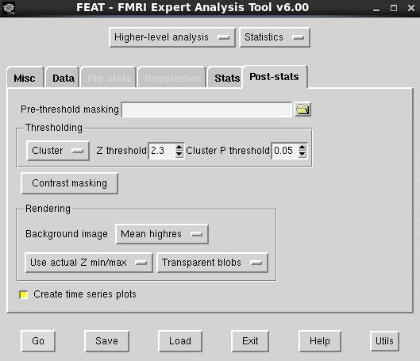

# fMRI-analysis-replication

This functional Magnetic Resonance Imaging (fMRI) analysis pipeline replicates the methods employed in Jessica Cohen's PhD thesis, 'The Neural Basis of Self-Control', in effort to identify the neural correlates of self-control in a Stop-Signal task (SS). This analysis was run using a slightly expanded version of the DS009 OpenFMRI dataset (https://openfmri.org/dataset/ds000009), as was used for Cohen's report.

The Centre for Human Brain Health's (CHBH) Parallel Brain Imaging computer Cluster (PBIC), based at the University of Birmingham, was used to store the data and run the analyses for this project. This uses Linux as the OS.

## Data/directory organisation

All files/folders used in this analysis were placed in the directory:
/home/people/ota277/replication/part_B. Within this directory were two
subdirectories. The /Participants subdirectory of the /part_B directory contained
24 folders, each corresponding to data for an individual participant/subject
(e.g. /sub-01, /sub-02, ..., /sub-N), formatted according to standard Brain
Imaging Data Structure (BIDS).

Each subject folder contained a subdirectory of anatomical
data (/anat) and a subdirectory of functional data (/func), as well as a
tab-separated values (TSV) file containing information about the respective
subject's data files.
Inside of the anatomical subdirectory was the in-plane
T2-weighted image (/sub-N_inplaneT2.nii.gz), a JSON file containing the
in-plane T2-weighted image acquisition information (/sub-N_inplaneT2.json), the
T1-weighted image (/sub-N_T1w.nii.gz), the cropped T1-weighted brain
(/sub-N_T1.nii.gz), the skull-stripped T1-weighted brain
(/sub-N_T1_brain.nii.gz), and a JSON file containing the T1-weighted image
acquisition information.
Inside of the functional subdirectory is data from a Balloon
Analog Risk Task (BART), which were not used in this replication, and data from
a Stop-Signal task (SS). The data files for the SS task are split over two
runs. This includes the 4D fMRI data for each run
(/sub-N_task-stopsignal_run-01_bold.nii.gz; /sub-N_task-stopsignal_run-02_bold.nii.gz),
the task/ fMRI acquisition information for each run
(/sub-N_task-stopsignal_run-01_bold.json;
/sub-N_task-stopsignal_run-02_bold.json) and tab-separated values (TSV) files
containing information about the events within each run
(/sub-N_task-stopsignal_run-01_events.tsv;
/sub-N_task-stopsignal_run-01_events.tsv).

These files and folders were available prior to the replication.
To store the outputs of this replication, three further subdirectories were created
within the /fMRI_analysis subdirectory, corresponding to first (/First_level),
second (/Second_level) and third-level (/Third_level) fMRI analyses:
```
cd /home/people/ota277/replication/part_B/fMRI_analysis
mkdir First_level
mkdir Second_level
mkdir Third_level
```

## FEAT
FSL's (6.00) FMRI Expert Analysis Tool (FEAT) was used to perform each level of the fMRI analysis.

# First-level analysis

The objective of the first-level analysis was to model the neural activity associated with self-control in each run of the SS task.

In the data tab, the 4D data from each run by each participant was input to FEAT. Each 4D data input comprised 184 volumes in total, with a repetition time (TR) of 2s. Cohen's original paper specified that high pass temporal filtering was applied to the data (Gaussian-weighted least-squares straight line fitting), with a smoothing kernel sigma of 33s. FEAT does not allow for the sigma of the smoothing kernel to be defined by explicitly by the user. However, this value is automatically set to half of the value that is input to define the high pass filter cut off (the threshold at which low frequencies are removed from the data, in order to maximise the signal-to-noise ratio). This value was therefore set to 66s, in order to not only replicate the 33s standard deviation of the smoothing kernel used by Cohen, but also remove extraneous low frequency noise from the data.


In the pre-stats tab of FEAT, Cohen's use of FSL's motion correction tool, MCFLIRT, was replicated using the option available. This tool works to correct for any head motion artifacts by aligning the functional data with a reference volume. The 5mm width of the Gaussian kernel, as specified in Cohen's report, was also defined in this tab. The Gaussian kernel is used to smooth the spatial data, in order reduce the effect of noise and control for abrupt spatial transitions in the functional images. As previously noted, Cohen also implemented high pass temporal filtering in her analysis, so this replication therefore also ensured that this was on, to match this control over low-frequency temporal noise.


Cohen's described 3-step nonlinear registration method was replicated within FEAT's registration tab. Specifically, the in-plane T2-weighted image was used as the input “Expanded functional image” (7 DOF); the skull-stripped T1 image was used as the “Main structural image” (7 DOF); the MNI152 structural image (12 DOF) was used as the standard space; and the nonlinear registration option was applied. This process aligns each participant's functional and anatomical data, and aligns the anatomical data to a standard space, to ensure consistency in the locations of measured activation.
Given Cohen's specification of a 10mm warp resolution, this was also implemented using the relevant parameter setting. These 'warps' apply deformations to the anatomical data, in order to fit it to the standard space, to allow for standardised navigation through the scanned brain regions. The application of these settings was not only justified by the report's use of the same parameters, but also by the fact that this allows for the enhancing of the spatial accuracy of the fMRI analysis.


In the stats tab, consistency with the original analysis was maintained by applying FILM pre-whitening. This is a useful tool for accounting for the temporal autocorrelation that is common to fMRI time series data, within the General Linear Model generated by FEAT. Given that Cohen included motion parameters and their temporal derivatives in her model, this was also applied in our analysis, using FEAT's “standard + extended motion parameters” option. This would allow both Cohen's analysis and our own data to more fully account for changes in head motion over time.
The model design was fully specified, as described by Cohen, in the “Full model setup” window. Specifically, four explanatory variables (EVs) were defined, constituting correct stops, correct go responses, incorrect stops and incorrect/missed go responses, in the SS task. These were each defined using Custom (3 column format) files (located in the /func subject subdirectory) which contained the onset, duration and amplitude of each trial event type. These EVs were each convolved with a double-gamma Haemodynamic Response Function (HRF), in order to model the BOLD response and corresponding neural activations for each variable. As the regressors of interest, the stop correct and go correct EVs were weighted with values of 1 and -1, respectively, in the “Contrasts and F-tests” tab. The other Evs, including the nuisance regressors of incorrect go trials, were weighted with a value of 0. This contrast allowed for testing of the difference between activations associated with successful stopping and successful going in the SS task, which matches the report's described comparison.

 
<br>
 
<br>
 

In the post-stats tab, the report's given cluster-based thresholding procedure was implemented, applying a z-threshold of 2.3 and a cluster p-threshold of 0.05. Because fMRI involves a large number of comparisons between voxels, there is an inherent risk of high Type I error rates (falsely detecting an effect, when the null hypothesis is true). By clustering adjacent voxels that sufficiently meet this z-threshold, this technique reduces the number of comparisons and helps to address the multiple comparisons problem, while uncovering regions of significant activity (determined by whether or not meet the cluster p threshold).


The outputs of this level of the analysis constituted 48 .feat files, corresponding to each participant's two runs of the SS task. These were saved in the /home/people/ota277/replication/ part_B/fMRI_analysis/First_level directory.

# Second-level analysis

Consistent with Cohen's study, the objective of this replication’s second-level analysis was to combine "across the two runs using a fixed effects model" (p.81), in order to ascertain the average neural activity of each participant during self-control on the SS task. This analysis level was set up within FEAT's “Higher-level analysis” window.

 


Inputs to this level constituted the lower-level FEAT directories, generated from the first-level analysis. Using the all-in-one approach, averages across the runs of each participant were calculated by assigning each pair of the 48 input task runs with weights of 1 for the respective participant that they were performed by. This linked the to-be-averaged runs with their parent participants.


In the contrasts tab, 24 contrasts were then defined – assigning the weight of 1 to the participant EV in the contrast of each column that corresponded to their combined run pair. This effectively set up the across-run averaging process, specified by Cohen's report for this level.


In the post-stats tab, again the cluster-based thresholding was applied (z = 2.3, p = 0.05), in order to replicate the consistent thresholding used by Cohen at each level of the analysis, which again controlled for the multiple comparisons and facilitated the evaluation of significant activations at the second level.


The across-run, individual participant outputs of this analysis level constituted 24 cope images that were output to the /home/people/ota277/replication/ part_B/fMRI_analysis/Second_level/cope1.feat directory.

# Third-level analysis

The final, third level of Cohen's analysis involved modelling at the group-level, across participants. As described in her report, Cohen achieved this using a mixed effects: FLAME 1 model (FMRIB's Local Analysis of Mixed Effects). The same model was therefore applied here. This mixed effects model is used to estimate group-level effects from data, while accounting for both within-subject variability and between-subject variability. It achieves this by considering not only the variance within subjects, modelled thus far by averaging across each participant's runs, but also the variance between subjects, which represents the random effects so far unaccounted for by the analyses. By implementing this model at the third level, therefore, this replication not only comprehensively model the brain activity across participants but also allowed for inferences to be made about the wider population – since the random variability that reflects individual differences and other sources of noise was accounted for, ultimately making the findings of the analysis more generalisable.


This step of Cohen's analysis was replicated by specifying the use of this model in the higher-level analysis stats tab. As was specified by Cohen, outlier de-weighting was applied to our mixed effects model. This would work to control for outliers in the data, which might otherwise skew the results, by assigning lower weights to points of greater deviation from the rest of the data.


Maintaining consistency with Cohen's design, the one EV defined at the third level constituted the across-participant activity. One contrast was performed with this EV, which involved averaging across all of the input participant data, to give a group-level effect, by assigning the sole EV with a weight of 1.

 

Again, the effect was thresholded via cluster-based thresholding with a z-threshold of 2.3 and a cluster p threshold of 0.05, in accordance with Cohen's procedures. This was specified within the post-stats tab of FEAT's higher-level analysis window.



The across-participant output of this analysis constituted one FEAT file, which was stored in the /home/people/ota277/replication/part_B/fMRI_analysis/Third_level/cope1.feat directory.

# Results

As presented in Figure 1, Cohen’s original study reported activations in the right lateral frontal pole, right inferior frontal gyrus, bilateral orbitofrontal gyrus, bilateral anterior cingulate cortex, right middle frontal gyrus, bilateral superior frontal gyrus, bilateral pre-supplementary motor area, bilateral striatum, bilateral thalamus, bilateral subthalamic nucleus, bilateral supramarginal gyrus, and bilateral occipital pole, during successful stopping in the Stop-Signal task.
As can be seen from the activation map in Figure 2, our replication successfully established similar patterns of activity. These findings therefore substantiate the original report’s suggested involvement of these regions during successful cognitive-motor control.


                                                          
Figure 1. The activation maps, given in Cohen’s original report, that present the regions of significant activity, as established by the contrast between successful stopping – successful going in the SS task.
<br>
<br>

<br>
Figure 2. The activation maps obtained from this replication.

